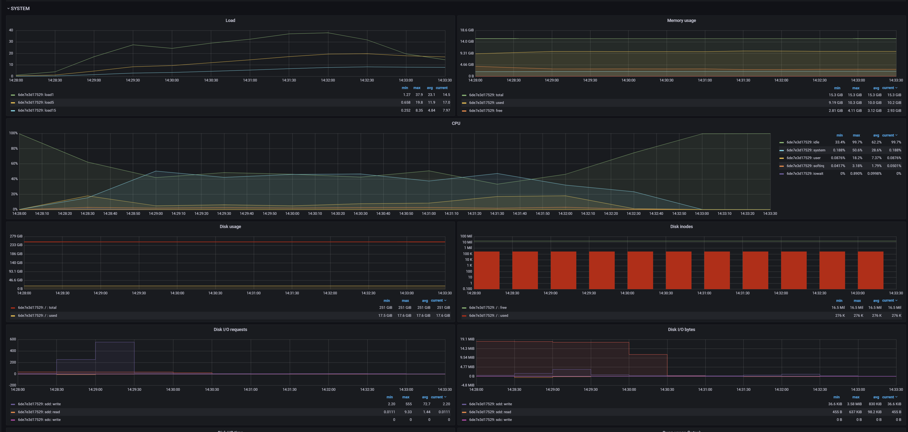
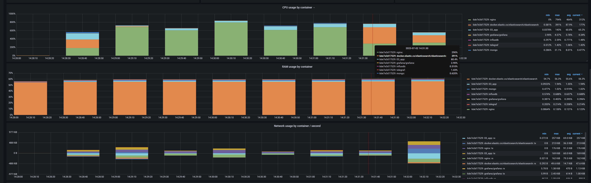

Start the app and monitoring:
```powershell
.\up.ps1
```

Run load testing:
```powershell
.\test.ps1
```

Turn off the app and monitoring:
```powershell
.\down.ps1
```




[Results with nginx](results-nginx.md)

[Results without nginx](results-nonginx.md)