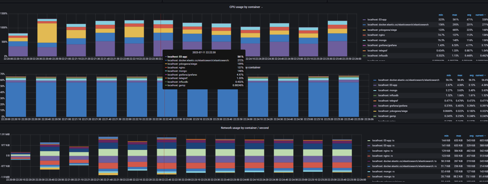
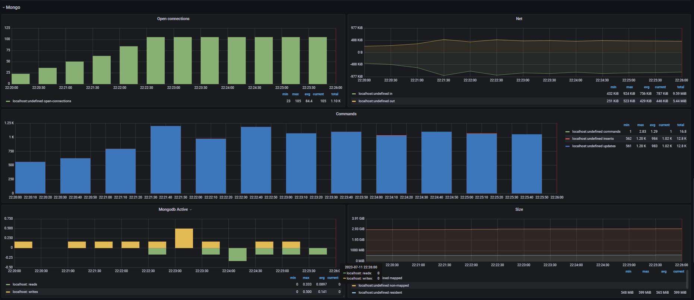

Start the app and monitoring:
```powershell
.\up.ps1
```

Run load testing:
```powershell
.\test.ps1
```

Turn off the app and monitoring:
```powershell
.\down.ps1
```

## siege output
```
Transactions:                 175576 hits
Availability:                 100.00 %
Elapsed time:                  59.06 secs
Data transferred:              12.09 MB
Response time:                  0.02 secs
Transaction rate:            2972.84 trans/sec
Throughput:                     0.20 MB/sec
Concurrency:                   49.80
Successful transactions:      175576
Failed transactions:               0
Longest transaction:            0.16
Shortest transaction:           0.00
```

## Grafana system metrics


## Grafana Docker metrics


## Grafana Elastic Search metrics


## Grafana Mongo metrics

