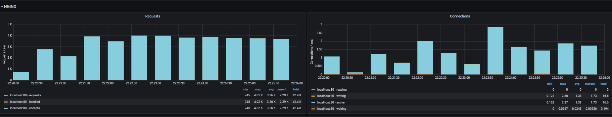
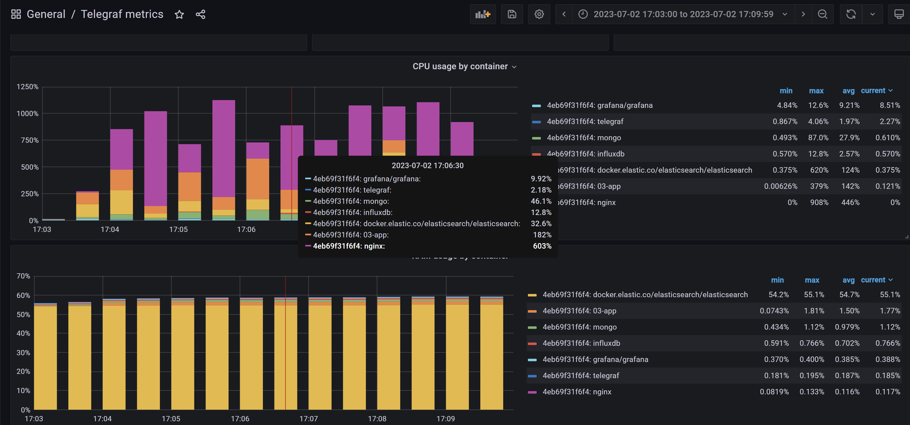

Start the app and monitoring:
```powershell
.\up.ps1
```

Run load testing:
```powershell
.\test.ps1
```

Turn off the app and monitoring:
```powershell
.\down.ps1
```

## test.ps1 output
```
Started load testing at 07/02/2023 14:28:34.
This is ApacheBench, Version 2.3 <$Revision: 1903618 $>
Copyright 1996 Adam Twiss, Zeus Technology Ltd, http://www.zeustech.net/
Licensed to The Apache Software Foundation, http://www.apache.org/

Benchmarking localhost (be patient)
Completed 5000 requests
Completed 10000 requests
Completed 15000 requests
Completed 20000 requests
Completed 25000 requests
Completed 30000 requests
Completed 35000 requests
Completed 40000 requests
Completed 45000 requests
Completed 50000 requests
Finished 50000 requests


Server Software:        nginx/1.25.1
Server Hostname:        localhost
Server Port:            5000

Document Path:          /api/products
Document Length:        114 bytes

Concurrency Level:      500
Time taken for tests:   54.870 seconds
Complete requests:      50000
Failed requests:        24557
   (Connect: 0, Receive: 0, Length: 24557, Exceptions: 0)
Non-2xx responses:      21769
Total transferred:      14007127 bytes
Total body sent:        9600000
HTML transferred:       6632975 bytes
Requests per second:    911.25 [#/sec] (mean)
Time per request:       548.699 [ms] (mean)
Time per request:       1.097 [ms] (mean, across all concurrent requests)
Transfer rate:          249.30 [Kbytes/sec] received
                        170.86 kb/s sent
                        420.15 kb/s total

Connection Times (ms)
              min  mean[+/-sd] median   max
Connect:        0    0   0.4      0       6
Processing:    60  539 229.7    468    2734
Waiting:       57  536 230.3    464    2732
Total:         61  539 229.7    468    2734

Percentage of the requests served within a certain time (ms)
  50%    468
  66%    565
  75%    653
  80%    718
  90%    883
  95%   1004
  98%   1081
  99%   1134
 100%   2734 (longest request)
Finished POST at 07/02/2023 14:29:29
This is ApacheBench, Version 2.3 <$Revision: 1903618 $>
Copyright 1996 Adam Twiss, Zeus Technology Ltd, http://www.zeustech.net/
Licensed to The Apache Software Foundation, http://www.apache.org/

Benchmarking localhost (be patient)
Completed 5000 requests
Completed 10000 requests
Completed 15000 requests
Completed 20000 requests
Completed 25000 requests
Completed 30000 requests
Completed 35000 requests
Completed 40000 requests
Completed 45000 requests
Completed 50000 requests
Finished 50000 requests


Server Software:        nginx/1.25.1
Server Hostname:        localhost
Server Port:            5000

Document Path:          /api/products
Document Length:        157 bytes

Concurrency Level:      500
Time taken for tests:   52.896 seconds
Complete requests:      50000
Failed requests:        28234
   (Connect: 0, Receive: 0, Length: 28234, Exceptions: 0)
Non-2xx responses:      50000
Total transferred:      21972054 bytes
Total body sent:        12750000
HTML transferred:       14117948 bytes
Requests per second:    945.24 [#/sec] (mean)
Time per request:       528.964 [ms] (mean)
Time per request:       1.058 [ms] (mean, across all concurrent requests)
Transfer rate:          405.64 [Kbytes/sec] received
                        235.39 kb/s sent
                        641.03 kb/s total

Connection Times (ms)
              min  mean[+/-sd] median   max
Connect:        0    0   0.4      0       5
Processing:    99  526 233.5    457    1766
Waiting:       11  524 233.7    454    1765
Total:         99  526 233.5    457    1767

Percentage of the requests served within a certain time (ms)
  50%    457
  66%    580
  75%    682
  80%    739
  90%    868
  95%    984
  98%   1088
  99%   1152
 100%   1767 (longest request)
Finished PUT at 07/02/2023 14:30:22
This is ApacheBench, Version 2.3 <$Revision: 1903618 $>
Copyright 1996 Adam Twiss, Zeus Technology Ltd, http://www.zeustech.net/
Licensed to The Apache Software Foundation, http://www.apache.org/

Benchmarking localhost (be patient)
Completed 5000 requests
Completed 10000 requests
Completed 15000 requests
Completed 20000 requests
Completed 25000 requests
Completed 30000 requests
Completed 35000 requests
Completed 40000 requests
Completed 45000 requests
Completed 50000 requests
Finished 50000 requests


Server Software:        nginx/1.25.1
Server Hostname:        localhost
Server Port:            5000

Document Path:          /api/products/1234567890
Document Length:        157 bytes

Concurrency Level:      500
Time taken for tests:   65.667 seconds
Complete requests:      50000
Failed requests:        28231
   (Connect: 0, Receive: 0, Length: 28231, Exceptions: 0)
Non-2xx responses:      21769
Total transferred:      9690876 bytes
HTML transferred:       3417733 bytes
Requests per second:    761.42 [#/sec] (mean)
Time per request:       656.668 [ms] (mean)
Time per request:       1.313 [ms] (mean, across all concurrent requests)
Transfer rate:          144.12 [Kbytes/sec] received

Connection Times (ms)
              min  mean[+/-sd] median   max
Connect:        0    0   0.3      0       6
Processing:    94  653 233.8    579    1760
Waiting:       12  650 234.5    577    1760
Total:         94  654 233.8    580    1761

Percentage of the requests served within a certain time (ms)
  50%    580
  66%    717
  75%    822
  80%    875
  90%    977
  95%   1073
  98%   1228
  99%   1352
 100%   1761 (longest request)
Finished Get by ID (Mongo) at 07/02/2023 14:31:27
This is ApacheBench, Version 2.3 <$Revision: 1903618 $>
Copyright 1996 Adam Twiss, Zeus Technology Ltd, http://www.zeustech.net/
Licensed to The Apache Software Foundation, http://www.apache.org/

Benchmarking localhost (be patient)
Completed 5000 requests
Completed 10000 requests
Completed 15000 requests
Completed 20000 requests
Completed 25000 requests
Completed 30000 requests
Completed 35000 requests
Completed 40000 requests
Completed 45000 requests
Completed 50000 requests
Finished 50000 requests


Server Software:        nginx/1.25.1
Server Hostname:        localhost
Server Port:            5000

Document Path:          /api/products?query=phon
Document Length:        157 bytes

Concurrency Level:      500
Time taken for tests:   69.561 seconds
Complete requests:      50000
Failed requests:        28232
   (Connect: 0, Receive: 0, Length: 28232, Exceptions: 0)
Non-2xx responses:      21768
Total transferred:      43823160 bytes
HTML transferred:       36449016 bytes
Requests per second:    718.79 [#/sec] (mean)
Time per request:       695.611 [ms] (mean)
Time per request:       1.391 [ms] (mean, across all concurrent requests)
Transfer rate:          615.23 [Kbytes/sec] received

Connection Times (ms)
              min  mean[+/-sd] median   max
Connect:        0    0   0.3      0       4
Processing:   102  692 304.1    605    3152
Waiting:       13  689 304.8    602    3148
Total:        102  692 304.1    605    3152

Percentage of the requests served within a certain time (ms)
  50%    605
  66%    771
  75%    874
  80%    915
  90%   1027
  95%   1119
  98%   1256
  99%   2223
 100%   3152 (longest request)
Finished Get by query (Elastic) at 07/02/2023 14:32:37
Finished load testing. Start time 07/02/2023 14:28:34. End time 07/02/2023 14:32:37
```

## Grafana system metrics

## Grafana Docker metrics
