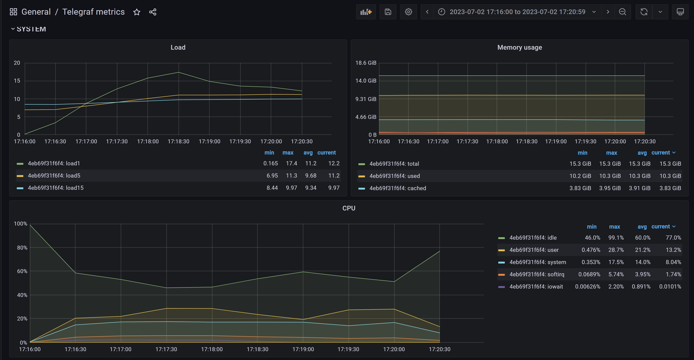
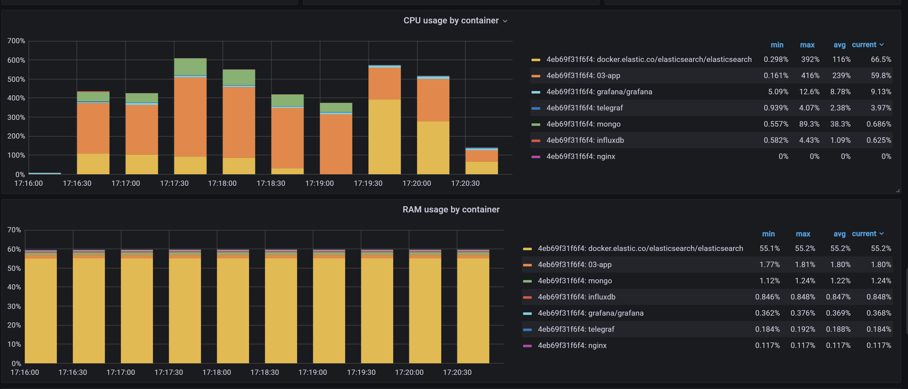

Start the app and monitoring:
```powershell
.\up.ps1
```

Run load testing:
```powershell
.\test.ps1
```

Turn off the app and monitoring:
```powershell
.\down.ps1
```
## test.ps1 output
```
Started load testing at 07/02/2023 17:16:28.
This is ApacheBench, Version 2.3 <$Revision: 1903618 $>
Copyright 1996 Adam Twiss, Zeus Technology Ltd, http://www.zeustech.net/
Licensed to The Apache Software Foundation, http://www.apache.org/

Benchmarking localhost (be patient)
Completed 5000 requests
Completed 10000 requests
Completed 15000 requests
Completed 20000 requests
Completed 25000 requests
Completed 30000 requests
Completed 35000 requests
Completed 40000 requests
Completed 45000 requests
Completed 50000 requests
Finished 50000 requests


Server Software:        Kestrel
Server Hostname:        localhost
Server Port:            5080

Document Path:          /api/products
Document Length:        114 bytes

Concurrency Level:      500
Time taken for tests:   61.309 seconds
Complete requests:      50000
Failed requests:        5030
   (Connect: 0, Receive: 0, Length: 5030, Exceptions: 0)
Total transferred:      12644408 bytes
Total body sent:        9600000
HTML transferred:       5694408 bytes
Requests per second:    815.53 [#/sec] (mean)
Time per request:       613.095 [ms] (mean)
Time per request:       1.226 [ms] (mean, across all concurrent requests)
Transfer rate:          201.41 [Kbytes/sec] received
                        152.91 kb/s sent
                        354.32 kb/s total

Connection Times (ms)
              min  mean[+/-sd] median   max
Connect:        0    0   0.5      0       4
Processing:   319  608  57.1    593     961
Waiting:       29  605  59.0    590     958
Total:        320  608  57.1    593     961

Percentage of the requests served within a certain time (ms)
  50%    593
  66%    604
  75%    619
  80%    630
  90%    677
  95%    718
  98%    776
  99%    815
 100%    961 (longest request)
Finished POST at 07/02/2023 17:17:30
This is ApacheBench, Version 2.3 <$Revision: 1903618 $>
Copyright 1996 Adam Twiss, Zeus Technology Ltd, http://www.zeustech.net/
Licensed to The Apache Software Foundation, http://www.apache.org/

Benchmarking localhost (be patient)
Completed 5000 requests
Completed 10000 requests
Completed 15000 requests
Completed 20000 requests
Completed 25000 requests
Completed 30000 requests
Completed 35000 requests
Completed 40000 requests
Completed 45000 requests
Completed 50000 requests
Finished 50000 requests


Server Software:        Kestrel
Server Hostname:        localhost
Server Port:            5080

Document Path:          /api/products
Document Length:        86 bytes

Concurrency Level:      500
Time taken for tests:   66.500 seconds
Complete requests:      50000
Failed requests:        0
Total transferred:      11250000 bytes
Total body sent:        12700000
HTML transferred:       4300000 bytes
Requests per second:    751.88 [#/sec] (mean)
Time per request:       665.000 [ms] (mean)
Time per request:       1.330 [ms] (mean, across all concurrent requests)
Transfer rate:          165.21 [Kbytes/sec] received
                        186.50 kb/s sent
                        351.71 kb/s total

Connection Times (ms)
              min  mean[+/-sd] median   max
Connect:        0    0   0.5      0       4
Processing:   264  660  76.3    646    1194
Waiting:       16  656  76.9    643    1193
Total:        264  661  76.3    646    1194

Percentage of the requests served within a certain time (ms)
  50%    646
  66%    657
  75%    666
  80%    674
  90%    695
  95%    806
  98%    926
  99%    989
 100%   1194 (longest request)
Finished PUT at 07/02/2023 17:18:36
This is ApacheBench, Version 2.3 <$Revision: 1903618 $>
Copyright 1996 Adam Twiss, Zeus Technology Ltd, http://www.zeustech.net/
Licensed to The Apache Software Foundation, http://www.apache.org/

Benchmarking localhost (be patient)
Completed 5000 requests
Completed 10000 requests
Completed 15000 requests
Completed 20000 requests
Completed 25000 requests
Completed 30000 requests
Completed 35000 requests
Completed 40000 requests
Completed 45000 requests
Completed 50000 requests
Finished 50000 requests


Server Software:        Kestrel
Server Hostname:        localhost
Server Port:            5080

Document Path:          /api/products/1234567890
Document Length:        0 bytes

Concurrency Level:      500
Time taken for tests:   52.048 seconds
Complete requests:      50000
Failed requests:        0
Total transferred:      5000000 bytes
HTML transferred:       0 bytes
Requests per second:    960.65 [#/sec] (mean)
Time per request:       520.479 [ms] (mean)
Time per request:       1.041 [ms] (mean, across all concurrent requests)
Transfer rate:          93.81 [Kbytes/sec] received

Connection Times (ms)
              min  mean[+/-sd] median   max
Connect:        0    0   0.5      0       4
Processing:   222  517  37.8    514     686
Waiting:        8  514  40.4    512     684
Total:        222  517  37.8    514     686

Percentage of the requests served within a certain time (ms)
  50%    514
  66%    522
  75%    528
  80%    532
  90%    546
  95%    564
  98%    617
  99%    665
 100%    686 (longest request)
Finished Get by ID (Mongo) at 07/02/2023 17:19:29
This is ApacheBench, Version 2.3 <$Revision: 1903618 $>
Copyright 1996 Adam Twiss, Zeus Technology Ltd, http://www.zeustech.net/
Licensed to The Apache Software Foundation, http://www.apache.org/

Benchmarking localhost (be patient)
Completed 5000 requests
Completed 10000 requests
Completed 15000 requests
Completed 20000 requests
Completed 25000 requests
Completed 30000 requests
Completed 35000 requests
Completed 40000 requests
Completed 45000 requests
Completed 50000 requests
Finished 50000 requests


Server Software:        Kestrel
Server Hostname:        localhost
Server Port:            5080

Document Path:          /api/products?query=phon
Document Length:        1169 bytes

Concurrency Level:      500
Waiting:      198  632  98.7    614    3138
Total:        219  635 100.0    617    3364

Percentage of the requests served within a certain time (ms)
  50%    617
  66%    645
  75%    670
  80%    688
  90%    723
  95%    778
  98%    952
  99%   1130
 100%   3364 (longest request)
Finished Get by query (Elastic) at 07/02/2023 17:20:36
Finished load testing. Start time 07/02/2023 17:16:28. End time 07/02/2023 17:20:36
```

## Grafana system metrics

## Grafana Docker metrics

