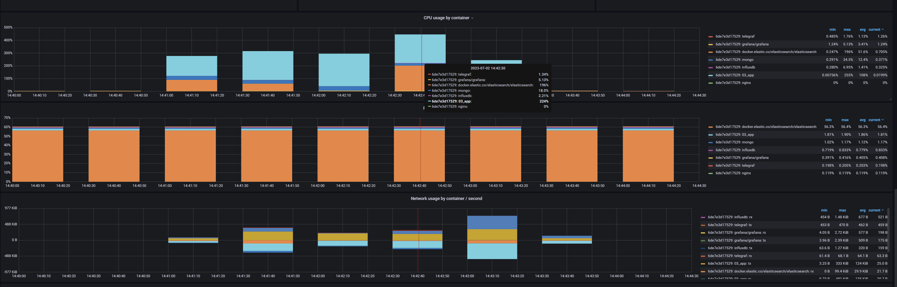

Start the app and monitoring:
```powershell
.\up.ps1
```

Run load testing:
```powershell
.\test.ps1
```

Turn off the app and monitoring:
```powershell
.\down.ps1
```
## test.ps1 output
```
Started load testing at 07/02/2023 14:41:10.
This is ApacheBench, Version 2.3 <$Revision: 1903618 $>
Copyright 1996 Adam Twiss, Zeus Technology Ltd, http://www.zeustech.net/
Licensed to The Apache Software Foundation, http://www.apache.org/

Benchmarking localhost (be patient)
Completed 5000 requests
Completed 10000 requests
Completed 15000 requests
Completed 20000 requests
Completed 25000 requests
Completed 30000 requests
Completed 35000 requests
Completed 40000 requests
Completed 45000 requests
Completed 50000 requests
Finished 50000 requests


Server Software:        Kestrel
Server Hostname:        localhost
Server Port:            5080

Document Path:          /api/products
Document Length:        114 bytes

Concurrency Level:      500
Time taken for tests:   33.157 seconds
Complete requests:      50000
Failed requests:        4994
   (Connect: 0, Receive: 0, Length: 4994, Exceptions: 0)
Total transferred:      12644484 bytes
Total body sent:        9600000
HTML transferred:       5694484 bytes
Requests per second:    1507.96 [#/sec] (mean)
Time per request:       331.575 [ms] (mean)
Time per request:       0.663 [ms] (mean, across all concurrent requests)
Transfer rate:          372.41 [Kbytes/sec] received
                        282.74 kb/s sent
                        655.15 kb/s total

Connection Times (ms)
              min  mean[+/-sd] median   max
Connect:        0    0   0.5      0       9
Processing:   112  329  55.9    315     706
Waiting:        9  327  56.0    313     705
Total:        112  330  55.9    315     706

Percentage of the requests served within a certain time (ms)
  50%    315
  66%    333
  75%    346
  80%    354
  90%    379
  95%    403
  98%    507
  99%    619
 100%    706 (longest request)
Finished POST at 07/02/2023 14:41:43
This is ApacheBench, Version 2.3 <$Revision: 1903618 $>
Copyright 1996 Adam Twiss, Zeus Technology Ltd, http://www.zeustech.net/
Licensed to The Apache Software Foundation, http://www.apache.org/

Benchmarking localhost (be patient)
Completed 5000 requests
Completed 10000 requests
Completed 15000 requests
Completed 20000 requests
Completed 25000 requests
Completed 30000 requests
Completed 35000 requests
Completed 40000 requests
Completed 45000 requests
Completed 50000 requests
Finished 50000 requests


Server Software:        Kestrel
Server Hostname:        localhost
Server Port:            5080

Document Path:          /api/products
Document Length:        379 bytes

Concurrency Level:      500
Time taken for tests:   25.182 seconds
Complete requests:      50000
Failed requests:        0
Non-2xx responses:      50000
Total transferred:      26750000 bytes
Total body sent:        12750000
HTML transferred:       18950000 bytes
Requests per second:    1985.56 [#/sec] (mean)
Time per request:       251.818 [ms] (mean)
Time per request:       0.504 [ms] (mean, across all concurrent requests)
Transfer rate:          1037.38 [Kbytes/sec] received
                        494.45 kb/s sent
                        1531.83 kb/s total

Connection Times (ms)
              min  mean[+/-sd] median   max
Connect:        0    0   0.5      0       8
Processing:   111  250  21.9    247     310
Waiting:        0  249  23.1    246     309
Total:        111  250  21.9    247     311

Percentage of the requests served within a certain time (ms)
  50%    247
  66%    254
  75%    259
  80%    264
  90%    280
  95%    291
  98%    299
  99%    303
 100%    311 (longest request)
Finished PUT at 07/02/2023 14:42:08
This is ApacheBench, Version 2.3 <$Revision: 1903618 $>
Copyright 1996 Adam Twiss, Zeus Technology Ltd, http://www.zeustech.net/
Licensed to The Apache Software Foundation, http://www.apache.org/

Benchmarking localhost (be patient)
Completed 5000 requests
Completed 10000 requests
Completed 15000 requests
Completed 20000 requests
Completed 25000 requests
Completed 30000 requests
Completed 35000 requests
Completed 40000 requests
Completed 45000 requests
Completed 50000 requests
Finished 50000 requests


Server Software:        Kestrel
Server Hostname:        localhost
Server Port:            5080

Document Path:          /api/products/1234567890
Document Length:        0 bytes

Concurrency Level:      500
Time taken for tests:   29.147 seconds
Complete requests:      50000
Failed requests:        0
Total transferred:      5000000 bytes
HTML transferred:       0 bytes
Requests per second:    1715.42 [#/sec] (mean)
Time per request:       291.474 [ms] (mean)
Time per request:       0.583 [ms] (mean, across all concurrent requests)
Transfer rate:          167.52 [Kbytes/sec] received

Connection Times (ms)
              min  mean[+/-sd] median   max
Connect:        0    0   0.5      0      12
Processing:   108  289  35.8    285     605
Waiting:        4  288  36.5    283     605
Total:        108  289  35.8    285     605

Percentage of the requests served within a certain time (ms)
  50%    285
  66%    297
  75%    305
  80%    309
  90%    319
  95%    326
  98%    366
  99%    466
 100%    605 (longest request)
Finished Get by ID (Mongo) at 07/02/2023 14:42:37
This is ApacheBench, Version 2.3 <$Revision: 1903618 $>
Copyright 1996 Adam Twiss, Zeus Technology Ltd, http://www.zeustech.net/
Licensed to The Apache Software Foundation, http://www.apache.org/

Benchmarking localhost (be patient)
Completed 5000 requests
Completed 10000 requests
Completed 15000 requests
Completed 20000 requests
Completed 25000 requests
Completed 30000 requests
Completed 35000 requests
Completed 40000 requests
Completed 45000 requests
Completed 50000 requests
Finished 50000 requests


Server Software:        Kestrel
Server Hostname:        localhost
Server Port:            5080

Document Path:          /api/products?query=phon
Document Length:        1170 bytes

Concurrency Level:      500
Time taken for tests:   37.715 seconds
Complete requests:      50000
Failed requests:        44908
   (Connect: 0, Receive: 0, Length: 44908, Exceptions: 0)
Total transferred:      65405092 bytes
HTML transferred:       58455092 bytes
Requests per second:    1325.73 [#/sec] (mean)
Time per request:       377.152 [ms] (mean)
Time per request:       0.754 [ms] (mean, across all concurrent requests)
Transfer rate:          1693.54 [Kbytes/sec] received

Connection Times (ms)
              min  mean[+/-sd] median   max
Connect:        0    0   0.5      0       6
Processing:   115  363  58.9    350    1268
Waiting:      109  361  58.6    348    1153
Total:        115  364  58.9    350    1268

Percentage of the requests served within a certain time (ms)
  50%    350
  66%    370
  75%    383
  80%    390
  90%    431
  95%    462
  98%    514
  99%    572
 100%   1268 (longest request)
Finished Get by query (Elastic) at 07/02/2023 14:43:15
Finished load testing. Start time 07/02/2023 14:41:10. End time 07/02/2023 14:43:15
```

## Grafana system metrics

## Grafana Docker metrics

